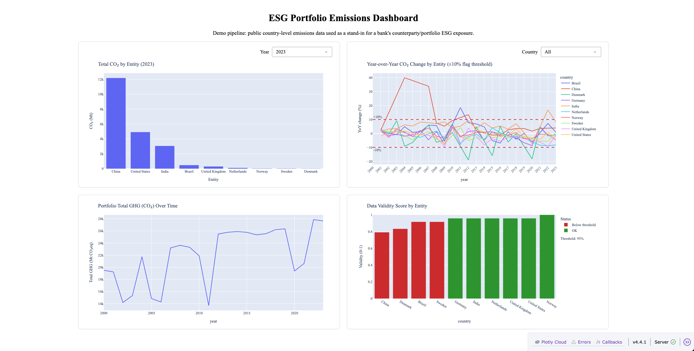

# ESG Emissions Data Pipeline & Quality Framework

A compact ETL pipeline that ingests emissions/GDP data, runs automated QA/QC, 
computes portfolio-level ESG KPIs, and serves them through an interactive dashboard. 
Built as a scoped demo of a data value chain used in portfolio risk exposure reporting functions.

## Data sources

Two interchangeable ingestion paths, both producing the same shape of data:

- **[Our World in Data CO2 & GHG dataset](https://github.com/owid/co2-data)** — static CSV, no auth required
- **World Bank REST API** — live pull via `EN.GHG.CO2.MT.CE.AR5` (CO2), `EN.GHG.ALL.MT.CE.AR5` (total GHG), and `NY.GDP.MKTP.CD` (GDP)

Ten countries (Norway, Sweden, Denmark, Germany, UK, US, China, India,
Brazil, Netherlands) stand in for the companies a bank might hold in
its lending/investment portfolio — real corporate-level emissions data
isn't freely available, so country-level data plays the same
structural role.

## Architecture

```
Raw data (OWID CSV or World Bank API)
        │
        ▼
   QA/QC checks ──► rejected rows (with reason code)
        │
        ▼
  KPI computation (pandas + SQL)
        │
        ▼
  Plotly-Dash dashboard
```

- `src/ingest.py` — loads the OWID CSV, filters to the tracked portfolio and year range
- `src/api_ingest.py` — same output shape, pulled live from the World Bank API instead
- `src/qc_checks.py` — schema, range, and year-over-year consistency checks; computes both a **completeness** score (missing values) and a **validity** score (rows that passed every check) per entity
- `src/kpi.py` — portfolio KPIs from QA-passed data, in pandas
- `src/db.py` — the same KPIs recomputed in **SQL** (SQLite), including LAG() (a built-in window-function) for YoY calculation, cross-checked against the pandas output
- `dashboard/app.py` — interactive Plotly-Dash dashboard (year/country filters, validity threshold shown on-chart)
- `tests/test_qc_checks.py` — unit tests for the QA/QC rules
- `pipeline_exec.ipynb` — runs the full pipeline step by step, for inspecting each stage's output

## KPIs

| KPI | Description |
|---|---|
| Total CO2 by entity | Ranked emissions for a selected year |
| Emissions intensity (CO2 / GDP) | Proxy for transition risk per unit of economic output |
| YoY % change | Year-over-year emissions trend, ±10% flagged on-chart |
| Portfolio total GHG | Aggregate GHG across the tracked portfolio, over time |
| Data completeness score | Share of non-null fields per entity |
| Data validity score | Share of records per entity passing *all* QA/QC checks; different from completeness score, as a field can be non-null and still be invalid |

## QA/QC checks

- **Schema check** — required fields (`country`, `year`, `co2`, `total_ghg`) present
- **Range check** — no physically implausible values (e.g. negative emissions)
- **Consistency check** — year-over-year change beyond 10% is flagged for review (chosen deliberately strict to demonstrate the data quality assurance mechanism, real historical volatility in this portfolio tops out around 18%)
- **Completeness & validity scores** — both computed and surfaced as their own KPIs

## To Run locally

```bash
pip install -r requirements.txt
```

Then work through `pipeline_exec.ipynb` (ingest or api_ingest → qc_checks → kpi → db), or run the dashboard directly once KPI files exist:

```bash
python dashboard/app.py       # serves at http://127.0.0.1:8050
pytest tests/                 # QA/QC unit tests
```

## Future improvements

- AWS deployment (Lambda + S3), in progress on a separate branch
- Orchestrate with **Airflow** instead of manual notebook steps, for retries/backfills
- Add **dbt** models for the transformation layer
- Replace country-level proxy data with real corporate emissions data (e.g. CDP) if licensing allows
- Data drift monitoring across pipeline runs, not just within one

## Dashboard


